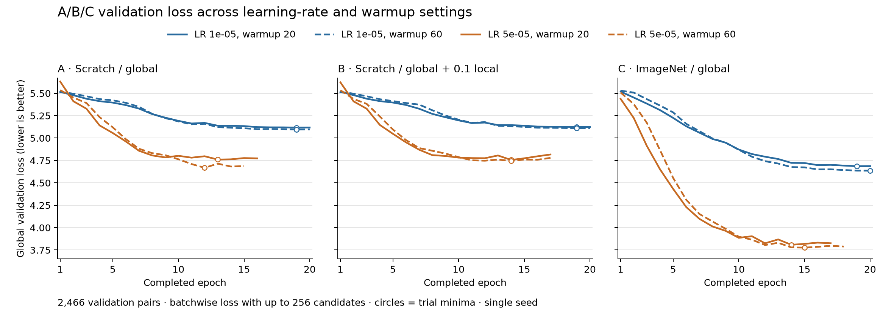

# PET–report OpenCLIP: consolidated experiment report

Updated 2026-10-02. The Bio_ClinicalBERT experiments fine-tune a **pretrained
text encoder** with a randomly initialized PET image encoder. Earlier experiments
trained both encoders from scratch. This report replaces
the separate training, local-learning, performance, and dated run-analysis reports.

**Current findings:** all 12 A/B/C HPO trials completed. ImageNet initialization
(C) with LR **5e-5**, warmup **60 updates** gives the lowest global validation loss
and **12.37% text→image R@5** at its retained checkpoint. Scratch A/B reach
3.81%/3.61%; adding local alignment has no consistent retrieval benefit in this
grid. Higher-LR runs show modest late overfitting, handled by early stopping.
The new ResNet50 attention architecture remains untrained. Experiment D now tests
ImageNet ResNet34 with global + 0.1 local alignment, matching C's selected settings.

## D: ImageNet initialization with global + local alignment — 2026-10-02

**Status: running on GPU 0; first 512-pair optimizer update completed successfully.**
D is the matched extension of C requested after
the completed A/B/C search. It initializes from the same ImageNet ResNet34 and
pretrained Bio_ClinicalBERT weights used at the start of C. Global concatenation/
projection weights use the same seed; the two local projection matrices initialize
randomly. This is a fresh ablation, with no resume from C's trained checkpoint.
Offline CPU verification found **exact equality of all 416 shared parameter/buffer
tensors** between C and D at initialization; the only additional tensors are
`region_image_projection.weight` and `region_text_projection.weight`.

| Setting | D |
| --- | --- |
| Model | `PET-ResNet34-BioClinicalBERT-Local`, `--pretrained-image` |
| Loss | Global + 0.1 × local; region dimension 128, up to 128 text tokens, chunk 32 |
| Learning rate / warmup | 5e-5 / 60 optimizer updates |
| Batch / GPU / precision | 256 × accumulation 2 = 512 candidates; GPU 0; BF16 |
| Data / image / text | split0; RAM cache; 224×224 inputs, canvas 310, SUV clip 30; Findings/Impression, context 1024 |
| Optimizer / schedule | AdamW, weight decay 0.1, cosine, seed 0, gradient checkpointing, workers 4 |
| Duration / selection | Maximum 20 epochs; patience 3; minimum global validation loss |
| Checkpoints | One `D/best.pt`; fresh selection threshold infinity |

`scripts/run_pet_d.py` derives its command directly from the completed C winner,
preserving all training settings except the added local branch and its options.
Its initial selection threshold is reset to infinity so D saves its own best
regardless of C's validation score. The existing training launcher was verified
identical to the C campaign's saved source snapshot. Logs and source snapshots:
`.local/pet/logs/d-20261002-imagenet-local/`; command/process state in `status.json`,
terminal stderr/stdout in `terminal.log`, epoch metrics under `trials/`.
W&B project remains `pet-bioclinicalbert-hpo`; run name
`d-20261002-imagenet-local-D`. GPU 1 remains available to other users.
Actual saved `params.txt` values were compared with C: only the model/local
options, output paths and fresh checkpoint-selection threshold differ. The first
update had finite global/local losses (6.2660 and 0.62786 weighted local), total
6.8938, with about 23.6 GiB GPU memory in use. These are startup measurements,
not validation results. Live [W&B run](https://wandb.ai/lingkai1999-chalmers-university-of-technology/pet-bioclinicalbert-hpo/runs/d-20261002-imagenet-local-D).

At launch, GPU 0 was idle and about 4.5 GiB was free on the original checkpoint
disk, enough for a retained ~1.56 GB checkpoint and its atomic replacement.
Compare D against C's retained global loss **3.7766**, text→image R@5 **12.37%**,
and image→text R@5 **12.45%**. Global/local validation losses and retrieval are
logged; improved visual grounding requires a separate evaluation. The test split
remains unused. Results are pending.

## Completed A/B/C comparison — 2026-10-02

**C is the strongest observed baseline; LR 5e-5 and warmup 60 minimize validation
loss in all three conditions.** This is a completed, single-seed, four-setting
search per condition, not an exhaustive optimum. A = scratch ResNet34/global loss;
B = scratch ResNet34/global + 0.1 local; C = ImageNet ResNet34/global loss.
All use two independent PET views, shared backbone weights, pooled concatenation
and linear projection, with pretrained, fine-tuned Bio_ClinicalBERT. Neither the
new attention fusion nor DINO was used in these experiments.

**Comparison basis:** train 10,785 pairs; validation 2,466 pairs; patient-separated
split0; test split unused. One A6000, physical batch 256, accumulation 2, effective
contrastive batch 512; BF16; images 224×224, canvas 310, SUV clip 30; Findings/
Impression text, context 1024; AdamW, weight decay 0.1, cosine schedule, seed 0.
Warmup 20/60 means optimizer updates (about 0.95/2.86 epochs), not batches or
epochs. There are 21 updates/epoch and a scheduled maximum of 20 epochs.

Selection minimizes `clip_val_loss`: sample-weighted global contrastive loss over
the entire validation split, computed within batches of up to 256 candidates.
Retrieval instead ranks the full **2,466-item gallery**. R@5 is the percentage of
queries whose designated paired scan/report is among the first five; random
ranking averages 0.203%. Every retrieval value below is from that trial's
**minimum-global-loss epoch**, not necessarily its peak-retrieval or final epoch.

### Full search: larger learning rate improved all conditions

| Run | LR | Warmup updates | Best/end epoch | Global val loss ↓ | Text→image R@5 ↑ | Image→text R@5 ↑ |
| --- | ---: | ---: | ---: | ---: | ---: | ---: |
| A | 1e-5 | 20 | 19/20 | 5.1172 | 1.34% | 1.30% |
| A | 1e-5 | 60 | 19/20 | 5.0953 | 1.42% | 1.22% |
| A | 5e-5 | 20 | 13/16 | 4.7599 | 3.33% | 3.37% |
| A | 5e-5 | 60 | 12/15 | 4.6681 | 3.81% | 4.26% |
| B | 1e-5 | 20 | 19/20 | 5.1241 | 1.09% | 1.22% |
| B | 1e-5 | 60 | 19/20 | 5.1104 | 1.14% | 1.14% |
| B | 5e-5 | 20 | 14/17 | 4.7556 | 3.85% | 3.20% |
| B | 5e-5 | 60 | 14/17 | 4.7442 | 3.61% | 3.81% |
| C | 1e-5 | 20 | 19/20 | 4.6859 | 1.78% | 3.00% |
| C | 1e-5 | 60 | 20/20 | 4.6360 | 2.43% | 3.00% |
| C | 5e-5 | 20 | 14/17 | 3.8081 | 12.41% | 11.92% |
| C | 5e-5 | 60 | 15/18 | 3.7766 | 12.37% | 12.45% |

At matched warmup 60, increasing LR raises text→image R@5 from 1.42% to 3.81%
(A), 1.14% to 3.61% (B), and 2.43% to 12.37% (C). Within this training budget,
the lower LR is less effective. Warmup 60 lowers minimum global validation loss
for all six matched condition/LR comparisons, but does **not** uniformly improve
retrieval. For C at LR 5e-5, warmup 20 retrieves 306/2,466 scans in the top five
versus 305 for warmup 60—only one query difference. Warmup 60 is preferred by the
predeclared loss criterion, not by every metric.

### Retained checkpoints: ImageNet initialization has the clearest advantage

All three retained checkpoints use LR 5e-5, warmup 60. The A/B/C checkpoint files
were opened on CPU and their trial names, selection values and epochs verified
against the epoch logs and campaign status.

| Run | Saved epoch / optimizer update | Text→image R@1 | R@5 hits | Text→image R@10 | Median paired-scan rank ↓ |
| --- | ---: | ---: | ---: | ---: | ---: |
| A | 12 / 252 | 0.81% | 94/2,466 | 6.69% | 232 |
| B | 14 / 294 | 0.81% | 89/2,466 | 7.18% | 219 |
| C | 15 / 315 | 3.93% | 305/2,466 | 19.63% | 64 |

C improves R@5 over A by **8.56 percentage points** (about 3.24×) at the retained
checkpoints. C also has lower validation loss and higher R@5 in both retrieval
directions at every matched LR/warmup setting. This supports pretrained image
initialization for the next baseline, although performance remains far from
reliable exact-scan retrieval.

B's effect is mixed: it slightly improves A's global loss and text→image R@5 at
LR 5e-5/warmup 20, but performs worse on those metrics at warmup 60. At the
retained checkpoints, B has better R@10 and median rank but worse R@5 than A.
This does not establish a consistent benefit from local loss, nor rule one out
with other weights or pretrained images. ImageNet + local was **not tested**.
B's retained local validation loss is 4.8068, and its weighted total is 5.2249;
these are different objectives and must not be compared directly with A/C's
global-only loss.

### Early stopping caught modest late validation deterioration

The curves show a strong learning-rate difference and small late reversals in
the high-LR runs. All six low-LR runs completed 20 epochs; all six high-LR runs
stopped after three non-improving validation checks. Circles mark each trial's
minimum; panels share the same focused loss scale.



For the retained settings, global validation loss rises from **4.6681→4.6871**
(A, epochs 12→15), **4.7442→4.7787** (B, 14→17), and **3.7766→3.7888**
(C, 15→18). Over those intervals, true epoch-average training global loss falls
4.8406→4.5374, 4.5474→4.3541 and 3.1895→3.0478, respectively. These opposite
trends are consistent with modest late overfitting; they do not imply a large
collapse. Training uses 512 candidates and validation up to 256, so absolute
train/validation loss levels should not be compared. Console parenthesized
values are an EMA; this diagnosis uses the explicit end-of-epoch averages.

### Next comparison and limits

Use C's retained checkpoint and LR 5e-5/warmup 60 as the reference for this
ResNet34 setup. Repeat with additional seeds and evaluate a frozen selection on
the untouched test split before claiming generalization. The same validation set
selected both epochs and hyperparameters, so these scores are selection-biased;
no confidence intervals or significance claims are warranted from this run alone.
Loss-selected checkpoints can miss peak R@5: C/warmup 60 peaks at 12.65% in epoch
16, but that epoch was not retained because its global loss was worse.

For the next architecture study, compare ResNet50 concatenation with ResNet50
attention under matched conditions; test pretrained DINO as a separate backbone
change. These experiments have not been launched by this analysis. Open questions
are whether local alignment helps a pretrained image encoder, whether better
fusion improves retrieval, and whether clinically similar unpaired reports affect
the exact-scan metric. These require additional experiments or annotations.

Evidence: `.local/pet/logs/hpo-20261001-abc-1gpu/` contains the completed campaign
`status.json`, per-trial `params.txt`, `out.log`, and `checkpoints/results.jsonl`.
`completed_summary.csv` and `completed_summary.json` contain the verified values,
curves and source hashes; `summarize_completed.py` reproduces them and the figure.
Exactly **three** checkpoints remain, `A/best.pt`, `B/best.pt`, `C/best.pt`, about
1.56 GB each (4.68 GB total). This analysis created no additional model checkpoint.

## Shared ResNet50 and spatial attention fusion — 2026-10-01

**Status: implemented and CPU-tested; not trained or added to the A/B/C HPO
campaign.** Following the user's choice, this replaces the earlier ResNet34 fusion
proposal with a shared ResNet50. Existing concatenation models remain available.

| Stage | Shape per scan at 224×224 | Implementation |
| --- | --- | --- |
| Independent coronal/sagittal inputs | 2×1×224×224 | Existing PET dataset and normalization |
| One shared ResNet50 | 2×2048×7×7 | Both views batched through the same backbone |
| Spatial token projection | 98×256 | Linear projection, LayerNorm, learned view IDs and fixed normalized 2D sinusoidal positions |
| Joint attention | 98×256 | Two pre-normalized self-attention/MLP blocks; eight heads, MLP ratio 4, dropout 0.1 |
| Learned-query pooling | 8×256 → 256 | Eight learned queries attend to all spatial tokens; residual, LayerNorm, then mean |
| CLIP projection | 512 | Linear projection; normalized for contrastive matching |

Attention connects features both within and between views. Fusion occurs before
global pooling. A region token retains its view/grid index, but its content includes
context from both images. Positions are within-view coordinates, not asserted 3D
correspondences. Tokens are overlapping CNN receptive fields, not lesion crops;
attention weights alone do not establish visual grounding.

New models: `PET-ResNet50-BioClinicalBERT-Attention` (global) and
`PET-ResNet50-BioClinicalBERT-Attention-Local` (global + 0.1 local).
The local variant aligns the **post-attention spatial tokens**, projected 256→128,
with report tokens; it does not align the eight pooled summary queries. Both use
the existing pretrained, trainable Bio_ClinicalBERT and windowed context 1024.
PET intensity normalization, canvas 310 and RAM data loading are unchanged.
At 310-pixel inference, the backbone produces two 10×10 grids (200 tokens);
position encodings are generated for that grid. Compatibility was tested, but
higher-resolution inference accuracy has not been evaluated.

`scripts/train_pet_attention_1gpu.sh` launches global-only training on GPU 0 by
default: ImageNet image initialization, BF16, batch 256 × accumulation 2 = 512,
LR 1e-5, warmup 20 updates, maximum 20 epochs, patience 3, one best checkpoint
selected by global validation loss. These are starting settings, not optimized
settings or a verified GPU memory fit. `PET_PRETRAINED_IMAGE=0` selects a scratch
image backbone; fusion always initializes randomly. Additional CLI arguments
override defaults; select the local model with `--model
PET-ResNet50-BioClinicalBERT-Attention-Local`. No training was launched here.

Implementation: `src/open_clip/multiview_attention.py`, `timm_model.py`, vision
configuration in `model.py`, and the optional branch in `local_region.py`.
Fusion participates in layer grouping/freezing and activation checkpointing.
**Validation: 48 CPU tests passed**, including the new attention tests, existing
multiview/Bio_ClinicalBERT/local-loss tests, two-process Gloo gradient regression,
cached accumulation, and best-checkpoint selection. Tests cover gradients through
both views, cross-view interaction, spatial/view identity, all trainable parameters,
BF16 autocast, dropout/checkpoint consistency, 224/310 inputs and strict checkpoint
round trips. Tiny local pretrained BERT fixtures avoid downloading weights.
GPU memory, throughput, full-batch training and PET retrieval remain unmeasured
for this architecture; benchmark before scheduling a full run.

## Focused literature review: multi-view feature fusion — 2026-10-01

The general CNN → spatial features → attention fusion design has clear precedents.
This is a targeted primary-source review, not an exhaustive novelty search. The
papers below support testing the design; their tasks and metrics do not establish
that it will improve our PET–report retrieval.

| Prior work | What is fused and how | Relationship to this implementation |
| --- | --- | --- |
| [van Tulder et al., 2021, Cross-View Transformers](https://arxiv.org/html/2103.11390v2) | Unregistered mammogram or frontal/lateral CXR feature maps; bidirectional cross-attention before the last ResNet18 stage. Image branches **do not share weights**. | Closest spatial-fusion precedent. Compares directly with pooled concatenation. Our shared ResNet50 and joint self-attention after the final stage are adaptations. |
| [CXR-CLIP, 2023](https://arxiv.org/html/2310.13292v1) | ResNet50/Swin-Tiny plus BioClinicalBERT; multiple study images and report sections linked by image–text, image–image and text–text contrastive objectives. Image representations are globally pooled. | Strong medical CLIP comparator. Multi-view supervision here does not implement joint spatial attention fusion. |
| [MLRG, CVPR 2025](https://arxiv.org/html/2502.20056v1) | RAD-DINO visual features with view/time embeddings; anchor-view queries cross-attend to other current views and a prior image. Contrastive pretraining precedes report generation. | Connects learned multi-view feature fusion to image–report alignment; differs in backbone, temporal inputs and generation objective. |
| [Set Transformer, ICML 2019](https://proceedings.mlr.press/v97/lee19d/lee19d.pdf) | Attention between set elements and pooling using learned seed queries. | Basis for our learned-query pooling. Our view/position tags add image structure; our head is a simplified adaptation, not an exact reproduction. |
| [LASM-mMIP, EJNMMI Research 2026](https://link.springer.com/article/10.1186/s13550-025-01357-w) | Four PET MIP views, parallel ResNet18 encoders and **averaged prediction probabilities**; lymphoma staging in 227 patients with five-fold cross-validation. | Direct PET/MIP precedent, but late decision fusion rather than attention or report contrastive learning. |

The cross-view transformer study reports mean CheXpert AUC 0.834 versus 0.829
for pooled concatenation; gains vary by finding. This is classification evidence,
not an expected PET retrieval improvement. [Study results, Table 2](https://arxiv.org/html/2103.11390v2).
MLRG also treats identical reports across visits as multiple positives, identifying
an alternative loss-design direction worth auditing separately from fusion.
[MLRG, §3.2](https://arxiv.org/html/2502.20056v1).

The previously discussed [MICCAI 2026 PET/CT report-generation paper](https://papers.miccai.org/miccai-2026/paper/0238_paper.pdf)
aggregates localized 3D lesion features with Set Transformer. Our available inputs
are two whole-body 2D MIPs, so lesion localization and volumetric inputs would be
needed to reproduce that pipeline.

**Experimental interpretation:** shared weights are a reasonable parameter-saving
choice for two views of the same PET modality, but are not proven optimal here.
To attribute a gain to fusion, compare ResNet50 + pooled concatenation against
ResNet50 + attention with matched initialization, text encoder, data, loss, effective
batch and training budget. Comparing only with current ResNet34 changes two factors.
Begin with global loss, then separately test local alignment. Compare validation
loss, full-gallery retrieval, GPU memory and time; inspect small-lesion sensitivity
before increasing attention depth. The review does not support a novelty claim
for CNN/attention fusion itself.

## Historical snapshot: first completed HPO trials — 2026-10-01

This interim snapshot is superseded by the completed comparison above.

The saved A/B checkpoints retrieve the paired PET scan in the top five for only
about 1% of validation reports. They outperform uniform random ranking but remain
weak for exact-scan retrieval; the local objective has not improved this metric in
the first tested configuration. This snapshot covers the completed **LR 1e-5,
warmup 20** trials only. C and the other hyperparameter trials are still pending.

Each of the 2,466 validation reports ranks all 2,466 PET scan embeddings (both views
fused). Recall@5 counts whether the designated paired scan is among the first five;
0.01 is **1%**, not 0.01%. Uniform random ranking would average 5/2,466 = **0.203%**.

| Saved checkpoint | Epoch | Global validation loss | Text→image R@5 | Successful reports | Median paired-scan rank |
| --- | ---: | ---: | ---: | ---: | ---: |
| A: scratch/global | 19 | 5.1172 | 1.338% | 33/2,466 | 512 |
| B: scratch/global + 0.1 local | 19 | 5.1241 | 1.095% | 27/2,466 | 509 |

At the last epoch (20), A/B R@5 were 1.298% and 1.176%, respectively. Those dashboard
values describe the final epoch, while retained checkpoints minimize global
validation loss. B's peak R@5 was 1.257% at epoch 15, so lower loss does not necessarily
select peak retrieval. The six-report difference between the saved A/B checkpoints
is descriptive; no statistical advantage is established from this single-seed run.

Both validation losses improved from about 5.515 at epoch 1 to their minima at
19, while final training global losses were 5.7268 (A) and 5.7345 (B). Thus these
curves do not establish a sustained overfitting increase. Training uses 512
contrastive candidates; validation loss uses within-batch candidates up to 256,
while retrieval searches the full 2,466-scan gallery. The raw train/validation loss
levels are therefore not directly comparable. Low LR/limited updates is a plausible
constraint, not a verified cause; the scheduled 5e-5 trials test a larger learning
rate. Similar reports and multiple scans can also make exact-scan matching demanding,
but their contribution has not been measured here.

Continue the existing grid and compare both retrieval and loss at retained
checkpoints before choosing hyperparameters. If all conditions remain weak, a
small-pair memorization check and direct scan/report identity audit can distinguish
optimization problems from pairing or preprocessing issues. The question of whether
retrieved mismatches are clinically similar requires a separate reviewed evaluation.
No running experiment was modified for this diagnostic.

Evidence: `checkpoints/results.jsonl` and `out.log` for the A/B first trials under
`.local/pet/logs/hpo-20261001-abc-1gpu/trials/`; exact selected/peak/final metrics
and source paths in `retrieval_diagnostic_20261001.json` in the campaign directory.
The definition was checked against `src/open_clip_train/metrics.py` (paired ranks,
R@k as the fraction with zero-based rank < k). This subsection uses the existing
user-requested Markdown report as the durable technical report surface, combining
summary, definitions, evidence, limitations and next steps.

## A/B/C learning-rate and warmup search — 2026-10-01

Requested ablations retain pretrained, trainable Bio_ClinicalBERT in every case:

| Experiment | Image initialization | Loss |
| --- | --- | --- |
| A | Scratch ResNet34 | Global only |
| B | Scratch ResNet34 | Global + 0.1 × local |
| C | ImageNet ResNet34 (`timm/resnet34.a1_in1k`) | Global only |

C uses timm's pretrained RGB first-convolution weights summed across channels for
single-channel PET. Exact equality of the adapted first convolution and an internal
ResNet layer against the pretrained source was checked. PET intensity normalization
and preprocessing remain identical across all three conditions.

The grid has four trials per experiment: LR `{1e-5, 5e-5}` × warmup `{20, 60}`
optimizer steps. Following the user's request to leave a GPU available, all use
**GPU 0 only**, batch 256 and **two-step accumulation** (512 contrastive pairs per
optimizer update), BF16, seed 0, context 1024, 224/224 images, split0, weight decay
0.1, and a cosine
schedule with a maximum of 20 epochs (420 updates). Warmup therefore spans about
4.8% or 14.3% of the full schedule. B uses local chunk 32 and up to 128 text tokens.

Selection and early stopping minimize **global validation loss (`clip_val_loss`)**
on the full 2,466-pair validation split, avoiding a different selection objective
for B. Stop a trial after three successive validation checks without a new minimum.
Retrieval metrics and B's local/combined losses remain logged. No test-set tuning.
This small single-seed grid finds the best observed configuration, not a guaranteed
optimum or a statistically conclusive comparison.

`scripts/run_pet_hpo.py` runs trials sequentially and interleaves A/B/C. Each
experiment has a single shared `best.pt` across all four trials, with model,
optimizer, selected metric/epoch, and trial arguments. Atomic replacement preserves
the prior best on a write failure, temporarily requiring one extra checkpoint's
space. Normal epoch/latest checkpoints are disabled. A 4 GiB free-space check
runs before each trial. Complete terminal stderr, metrics, commands, and source
snapshots are retained. W&B project: `pet-bioclinicalbert-hpo`; LR logged every step.

Completed single-GPU campaign output: `.local/pet/logs/hpo-20261001-abc-1gpu/`,
with final `status.json`,
`report.md`, trial logs, and selected `A/best.pt`, `B/best.pt`, `C/best.pt`.
The earlier two-GPU campaign (`hpo-20261001-abc`) launched at 12:49 and was
stopped at the user's request before a checkpoint was saved. Its logs are preserved.
The user then authorized continuing on one GPU with accumulation; the first trial
was restarted from initialization, using a new output directory. All 12 trials
completed successfully; final winners and comparisons are recorded above.
The campaign report was generated automatically as trials finished.
W&B: https://wandb.ai/lingkai1999-chalmers-university-of-technology/pet-bioclinicalbert-hpo .
An initial launch lost its parent session during cache loading, before training;
its workers were stopped and its logs preserved in the `-launch-interrupted` sibling
directory before restarting the campaign.

The old shared CUDA environment had been removed. Restored PyTorch 2.10.0+cu128,
torchvision 0.25.0+cu128, transformers 5.16.1, and training dependencies directly in
`.local/pet-cuda-venv`, keeping downloads temporary in RAM to avoid a disk cache.
Checkpoint/early-stopping, accumulation, and PET model/loss/evaluation
unit tests: **44 passed**, including a simulated complete 12-trial
search verifying the three retained winners and their parameter selections. Two-A6000 BF16 smokes at 256/GPU passed for B and C,
including global/local validation, synchronized early stopping after a controlled
metric worsened, retaining the earlier best, and loading the saved checkpoint.
Smoke checkpoint files were removed after verification.

Single-GPU PET accumulation caches two encoder microbatches, evaluates the loss
once over their concatenated features, then replays each microbatch using its
feature gradients. Global and local losses both see all **512 candidate pairs**
(511 negatives per anchor); this is not an average of independent 256-pair losses.
Replay restores the original PyTorch RNG state for BERT dropout and preserves
BatchNorm running buffers so caching/replay does not double their updates. Scalar
gradients (e.g. logit scale) are applied once. Tests compare losses, all parameter
gradients/updates, RNG progression and BatchNorm buffers against a reference that
retains both microbatch graphs; both global/local and gradient-scaled paths pass.
BatchNorm statistics still come from each physical microbatch, not a single
512-pair encoder forward. Region accumulation is enabled for single-GPU PET only.
Single-A6000 BF16 smokes passed for both B and C at batch 256 with accumulation 2,
including validation and best-checkpoint loading. B also passed controlled early
stopping. Saved counters confirmed one optimizer step and 512 samples; GPU 1
remained unused. The smoke checkpoints were removed after verification.


## Checkpoint storage update — 2026-09-30

The latest run (`pet-bioclinicalbert-2gpu-20260930-171916-962755076-1230372`)
finished epoch-6 validation but left an incomplete 169 MB `epoch_6.pt` while the
root filesystem was full. `epoch_5.pt` passed archive CRC validation and loads
with model and optimizer state; use epoch 5 to resume, not epoch 6.

The entire run was moved to `/mnt/scapis3/lingkai/open_clip/logs/`, with every
file verified by SHA-256 before removing the source copy. The original run path
under `.local/pet/logs/` is now a symlink. The incomplete checkpoint is preserved
for diagnosis. No training was restarted.

After space was freed on the original disk (25 GB available), the
Bio_ClinicalBERT launcher was switched back to `$REPO_DIR/.local/pet/logs` for
new checkpoints, experiment logs, and W&B working files. The previously migrated
run remains on `/mnt/scapis3/lingkai/open_clip/logs`, accessible through its
original symlink; it was not moved back. Override with `PET_LOG_DIR`; an explicit `--logs`
argument overrides the training log path, and `WANDB_DIR` independently overrides
W&B's working directory. Checkpoint retention settings are unchanged.

## Bio_ClinicalBERT experiment (new)

The text encoder now supports pretrained
[`emilyalsentzer/Bio_ClinicalBERT`](https://huggingface.co/emilyalsentzer/Bio_ClinicalBERT):
12 bidirectional BERT layers, width 768, 12 heads, 28,996-token cased WordPiece
vocabulary. Encoder weights are loaded with `from_pretrained` and remain trainable.
The PET ResNet34 and global/local projection heads initialize randomly. No report
generation or LLM-based filtering is introduced.

```bash
bash scripts/train_pet_bioclinicalbert_2gpu.sh /mnt/snotra1/ida/datasets/lymphoma_mskcc_deid
```

The launcher selects `PET-ResNet34-BioClinicalBERT-Local`, 128 pairs/GPU, chunk 32,
BF16, 224/224 images, and a shared LR of **5e-5** (lower than the scratch baseline).
This is an initial fine-tuning setting, not an optimized LR. Global-only comparison
config: `PET-ResNet34-BioClinicalBERT`. Existing scratch launchers remain available.
Pretrained files are cached under `.local/pet/hf-cache` (`HF_HOME` can override it);
no patient data is sent to Hugging Face. The downloaded revision was
`d5892b39a4adaed74b92212a44081509db72f87b`.

**Long reports are preserved using windows.** Native BERT supports 512 positions;
we retain the 2,560-token report context and encode up to 510 content positions per
window with fresh CLS/SEP tokens. Pretrained positional embeddings are unchanged.
There is no attention across windows. Content-token-weighted mean pooling combines
window outputs, followed by a learned 768→512 global projection. Local alignment
samples up to 128 valid WordPiece features across the entire retained report and
projects 768→128; padding/CLS/SEP are excluded. Both validation losses are supported.
These text windows are separate from image–report loss chunks discussed below.

The cased-tokenizer audit found 7,579/10,785 training reports (**70.3%**) and
1,821/2,466 validation reports (**73.8%**) exceeded 512 tokens. All retained reports
fit 2,560: maximum 2,130 (train), 2,091 (validation), 1,924 (test), including special
tokens. Thus single-window truncation was rejected. Source:
`.local/pet/bioclinicalbert_token_audit.json`. Text filtering and image preparation
are unchanged; the notebook now previews the Bio_ClinicalBERT tokenizer by default.

Verification: every downloaded encoder tensor matched the source pretrained weights
exactly. **37 tests passed**, covering pretrained initialization, HF/native local
alignment, windowed tail-token influence/gradients, unchanged positional weights,
and global/local validation. Notebook execution passed. A two-A6000 BF16 test passed
two epochs with global/local validation and partial validation batches at 4/GPU.
The default **128 pairs/GPU** also passed two training updates and validation on
512 pairs with the 2,560-token windowed context. This verifies execution, not
convergence or generalization.
No full Bio_ClinicalBERT experiment has been started. Scratch checkpoints cannot
resume into this architecture because text weights/tokenizer/shapes differ; start
a new run, then resume only matching Bio_ClinicalBERT checkpoints.

## Scratch baseline configuration and launch

| Component | Current implementation / launcher settings |
| --- | --- |
| Models | `PET-ResNet34` (global only); `PET-ResNet34-Local` (global + local) |
| Images | Independent single-channel coronal and sagittal MIPs, in that order |
| Global vision | Shared ResNet34 → average-pool each view to 512 → concatenate to 1,024 → bias-free projection to 512 → L2 normalization |
| Global text | Native causal CLIP Transformer: 12 layers, width 512, 8 heads, vocabulary 49,408; EOT pooling → normalized 512-vector |
| Text input | Findings + Impression; Summary excluded; fixed context 2,560 tokens |
| Initialization | Random image/text weights; reuse CLIP tokenizer only; no pretrained LLM or summarizer |
| Hardware | Two RTX A6000 48-GB GPUs; DDP/NCCL, one complete model per GPU |
| Batch / workers | Global launcher: 256/GPU, 16 workers/rank; local launcher: 128/GPU, 4 workers/rank |
| Precision / memory | BF16 AMP, FP32 parameters, no gradient scaler; gradient checkpointing; RAM image cache |
| Optimization | AdamW, LR 5e-4, weight decay 0.1, 50 epochs, 200 warmup steps, seed 0; starting settings, not retuned for local learning |
| Evaluation / saving | Rank-0 validation each epoch; global retrieval and global/local losses; latest epoch retained, best checkpoint not retained automatically |
| Tracking | W&B: `pet-resnet34-concat-scratch` or `pet-resnet34-global-local-scratch` |

```bash
# Recommended local run; explicit overrides match the measured configuration.
bash scripts/train_pet_local_2gpu.sh /mnt/snotra1/ida/datasets/lymphoma_mskcc_deid \
  --batch-size 128 --pet-region-chunk-size 32

# Global-only control at the same batch size.
bash scripts/train_pet_2gpu.sh /mnt/snotra1/ida/datasets/lymphoma_mskcc_deid --batch-size 128
```

Additional arguments override defaults. Local controls are `--pet-region-loss-weight`
(default 1), `--pet-region-max-tokens` (128), and `--pet-region-chunk-size` (4).
Other local settings are in [PET-ResNet34-Local.json](../../src/open_clip/model_configs/PET-ResNet34-Local.json).
Resume with the same architecture/settings and `--resume PATH`; global-only weights
lack local projections and are not drop-in local resume checkpoints.

Runtime: `.local/pet-cuda-venv/bin/python`, Python 3.11, PyTorch 2.10.0+cu128,
torchvision 0.25.0+cu128, timm 1.0.30, driver 565.57.01. To save disk, CUDA packages
are referenced through a `.pth` link to the existing Vision-Transformer environment;
that environment must remain available. Recreate with `scripts/setup_pet_cuda_env.sh`
and its source-environment argument. `PYTHON_BIN` overrides the interpreter.
Unique run names prevent collisions; logs/checkpoints live under `.local/pet/logs/`.

## Data and preprocessing

Source: `/mnt/snotra1/ida/datasets/lymphoma_mskcc_deid`. `PET_binaries` contains
little-endian float32 **2D projections**, not volumes. Join `data_scan_did.csv`,
`data_Scan_Report.csv`, and `data_splits.csv` on both `MRN_DID` and `ACCESSION_DID`
as strings. Two ambiguous scan keys remove four of 16,580 rows, leaving
**16,576 pairs / 5,073 patients**: split0 has **10,785 train / 2,466 validation /
3,325 test**, with no patient overlap. These are pairing counts before section filtering.
All referenced binaries passed existence/size checks; crops were nonempty and at
most 300×213. Recorded spacing is 3.27 per axis; physical intensity calibration
was not independently verified.

### Text filtering

[pet_text.py](../../src/open_clip_train/pet_text.py) applies deterministic Python rules:

1. Standardize line endings, collapse repeated spaces/tabs/nonbreaking spaces, trim
   lines, and remove blank lines while keeping nonempty lines separate.
2. Retain **Findings and Impression**, recognizing case-insensitive, numbered,
   colon-delimited or standalone headings. Preserve wording, negation, uncertainty,
   numbers, anatomy subheadings, and source order.
3. Remove **Summary headings and contents**, retaining subsequent Findings/Impression.
4. End selected sections at recognized administrative headings, signatures,
   standalone `FINAL REPORT`, and final-report communication footers. Preserve
   clinical mentions of “final report” inside prose.
5. Strip the dated “Integrated Imaging Summary for above study and CT chest abdomen
   pelvis performed [date]” introduction from retained sections, preserving following
   clinical text. This does not restore excluded Summary content.
6. Deduplicate sections with identical headings and cleaned bodies. Use either
   selected section if only one exists; exclude/count reports with neither usable
   section, including Summary-only reports. There is no automatic full-report fallback.

`record['report']` is training text; `record['full_report']` preserves the original
in memory. `--pet-report-sections full` explicitly bypasses filtering. Source CSVs
are unchanged. **13 filtering tests passed**; unusual templates still need review.

Historical audit before Summary exclusion: all pairs retained, cleaned token lengths
(including special tokens) median **477**, p95 **862**, maximum **1,923**. Full reports
had median 895, p95 1,302, maximum 2,398. Final-filter token statistics have not been
recomputed. Shorter text does not reduce fixed-padding compute; changing context to
2,048 also changes checkpoint positional-embedding shapes.

### Images and storage

Crop each view to its nonzero bounding box, including the last row/column; place on
a **310×310 canvas** (random placement for training, centered for evaluation); clip
to `[0,30]`; resize with antialiased bilinear interpolation (`align_corners=False`);
normalize by **`(image - 2.13) / 3.39`**, including padding. Training then scales each
view independently by a random factor in `[0.85,1.15]`.

Both launchers now use **224×224 training and validation**. Earlier experiments used
310-pixel validation. Canvas size and model-input size are separate: shrinking the
canvas to 224 rejects valid crops. The model supports larger inference inputs through
adaptive pooling, but larger resolution has not improved the measured retrieval.
Constants follow `/home/lingkai/code/lymphoma_classification_2023`; no RGB replication,
8-bit export, or PIL preprocessing is used. The [LARS reference](https://pubmed.ncbi.nlm.nih.gov/38135556/)
combines view-level probabilities; our embedding concatenation is an adaptation.

`--pet-cache ram` stores raw float32 crops in shared host memory for each rank's
workers; ranks duplicate caches, approximately **19 GiB total** for both splits/ranks.
Output resizing does not shrink this cache. `--pet-cache none` reads on demand.
No converted images/report CSVs are exported; checkpoint replacement needs temporary
space for both old and new files.

[Visualization notebook](../../tutorials/visualize_pet_report_pairs.ipynb): actual
`PetReportDataset` views, original/filtered report panels, token counts, and normalized
pixel histograms including padding. Restart the kernel after filter edits; clear
patient-data outputs before sharing. `scripts/prepare_pet_pairs.py` provides a read-only audit.

## Local region–text objective and distributed behavior

[local_region.py](../../src/open_clip/local_region.py) adds a spatial branch before
ResNet pooling: project each 512-channel location to 128 dimensions and normalize.
At 224 pixels, two 7×7 maps give **98 regions/scan**. Tensor axes preserve view and
spatial identity; no learned view/position embeddings are added, and background
regions participate. Global concatenation remains unchanged.

The text branch projects contextual CLIP **subword** features to 128 dimensions.
It excludes SOT/EOT/padding and uniformly samples up to **128 content tokens across
the report**; shorter reports use all content tokens. Headers/punctuation remain.
The global branch still consumes the full context.

For each image–report candidate pair: compute region/token similarities, normalize
over valid tokens per region, attend over regions per token, form weighted visual
vectors, compare with token vectors by cosine similarity, then aggregate using
scaled **log-mean-exp**. Symmetric cross-entropy distinguishes paired from mismatched
examples. This adapts [GLoRIA §§3.2.3–3.2.5](https://openaccess.thecvf.com/content/ICCV2021/papers/Huang_GLoRIA_A_Multimodal_Global-Local_Representation_Learning_Framework_for_Label-Efficient_Medical_ICCV_2021_paper.pdf):
we use two PET views, causal CLIP subwords, sampling, and a mean correction instead
of the paper's log-sum-exp. It is not an exact reproduction.

Total loss = **global CLIP loss + weight × local region loss**. Logged
`region_contrastive_loss` is already weighted. Attention, token-aggregation, and
local contrastive temperatures are 0.1, 0.1, and 0.07; local temperature is fixed,
while global logit scale is learned. Local attention uses FP32, with TF32 matmul
allowed, even during BF16 encoder training.

**“Local” has two meanings:** OpenCLIP `--local-loss` distributes query rows across
GPUs; region–text alignment learns spatial associations. Both paths gather features
with gradients, compare local queries against global candidates, and offset labels
by rank. DDP averages parameter gradients. Equal per-rank shapes are required;
the training loader drops incomplete batches. Single-process eager execution also
works; the task factory rejects accumulation, FSDP, compilation, SigLIP, and distillation
for the region branch.

NCCL uses **`NCCL_P2P_DISABLE=1`**: direct peer transfers stalled on this host, while
host-memory fallback passed. NVLink is inactive. This workaround's root cause remains
unresolved. Compilation is disabled: an earlier compiled global batch-256 backward
requested a 25-GiB text-attention tensor and ran out of memory.

### Global and local validation (added 2026-09-25)

`PET-ResNet34-Local` now emits both global and spatial/token features during paired
validation, while remaining in evaluation/inference mode. The local matching function,
token mask, temperatures, and loss weight are identical to training. Rank zero scores
within-batch candidates without distributed gathers; other DDP ranks do not need to
enter the local-loss computation. No weights, BatchNorm statistics, or gradients change.

| Metric | Meaning |
| --- | --- |
| `clip_val_loss` / `global_val_loss` | Existing global symmetric contrastive validation loss; both keys have the same value |
| `local_val_loss` | Unweighted symmetric region–token contrastive validation loss |
| `weighted_local_val_loss` | Local loss multiplied by the configured region weight |
| `total_val_loss` | Global loss + weighted local loss |
| `local_val_num_samples` | Number of pairs included in the local validation loss |

Losses are sample-weighted averages of batch losses, including the last partial batch.
They appear in console output and the existing JSONL/W&B/TensorBoard evaluation sinks
when enabled. Global retrieval still ranks against the full validation gallery;
**local validation uses within-batch negatives and does not report local retrieval or
localization accuracy**. Training gathers global-batch negatives, so absolute train/val
losses can still differ because candidate counts differ. Compare trends under fixed
batch settings. The global-only model keeps its existing evaluation behavior.

Verified: **57 tests passed**, including training/validation local-objective equivalence,
partial-batch weighting, unchanged BatchNorm state/no gradients, and no validation
collectives. A real PET two-A6000 BF16 smoke completed two epochs, two updates/epoch,
and validation over 18 pairs at batch 4/GPU (last validation batch size 2). No external
tracking or checkpoint export was enabled. Existing local checkpoints remain compatible;
the new metrics appear on the next run/resume, not retroactively in old logs.

`encode_regions` returns `[B,view,H,W,D]`; `encode_local_text` returns sampled features
and masks for future visualization. Attention maps and lesion-localization evaluation
are not yet implemented; MIPs do not uniquely identify 3D lesion locations.

## Important: chunking and GPU parallelism

A chunk partitions the **image–report score matrix**, not image pixels or text.
Size `C` processes up to **C images × C reports = C² comparisons** together.
For 128 pairs total, a 128×128 matrix with C=4 has **1,024 blocks**, not 16,384/4.

Our two-GPU batch is 128/GPU, or 256 total. Each GPU compares 128 local images
against 256 reports (image→text) and 128 local reports against 256 images (text→image).
These directions select the correct report or scan; they are not PET view directions.

| Chunk C | Comparisons/block | Blocks/direction/GPU | Blocks for both directions/GPU |
| --- | ---: | ---: | ---: |
| 4 | 16 | 2,048 | 4,096 |
| 16 | 256 | 128 | 256 |
| 32 | 1,024 | 32 | 64 |

**Comparisons within a chunk run in parallel on the GPU; our loop processes chunks
sequentially. Both GPUs work in parallel.** Smaller chunks save temporary memory
but add kernel-launch/checkpoint overhead; checkpointing recomputes attention during
backward. Larger chunks provide more work per operation. More chunks are not inherently
better. Chunk boundaries do not restrict negatives: scores are assembled before
cross-entropy. Batch size, tokens, and mathematical loss remain unchanged, apart
from floating-point rounding.

Local work is quadratic in batch size: increasing 16→128 pairs/GPU increased pair
calculations 64-fold and chunks from 64→4,096 at C=4. Both directions currently
recompute pair scores; exchanging differentiable score rows could avoid duplication,
but that optimization has not been implemented.

## Measured performance on two A6000s

128 pairs/GPU, 224-pixel views, 2,560 global tokens, 128 local tokens, BF16,
checkpointing, NCCL host-memory fallback. Full-model runs used four updates on 1,024
real pairs; medians exclude the first update and include optimizer/DDP work.
Lazy reads/zero workers avoided cache setup; no validation, checkpoints, or external
tracking. Isolated loss runs used synthetic features, one warmup and three measured
updates, synchronized stages, and the slowest rank's timings.

| Configuration | Full-model median step | Isolated loss forward + backward | Isolated peak allocation |
| --- | ---: | ---: | ---: |
| Global only | 4.645 s | 1.529 ms | 24.8 MiB |
| Global + local, C=4 | 22.364 s | 10.452 s | 65.4 MiB |
| Global + local, C=16 | 5.788 s | 0.885 s | 206.7 MiB |
| Global + local, C=32 | **5.439 s** | **0.741 s** | 659.2 MiB |

C=32 gives **4.11× faster full training than C=4**, with **17.1% overhead over global
only**. Local-feature gathering/reduction took **4.218 ms including backward** in
isolation, excluding DDP parameter gradients. BF16 local-feature payload is
7.0625 MiB/rank before forward gathering; chunking does not reduce that payload.
The measurements identify chunk size 4 as a major avoidable cost, not feature exchange
as the dominant isolated-loss cost. They are not an additive full-step decomposition.

Local full-model runs peaked at **20,438 MiB/GPU**, sampled every 250 ms including
startup; the global control peaked at 21,678 MiB. These coarse device-level figures
include allocator/workspace effects and do not show that local learning needs less
memory. First steps took 31.065/14.449/14.048 s for C=4/16/32 and were excluded.
Data loading took 0.335–0.438 s/step. Short-run results are not a long-run speed or
maximum-batch guarantee. Defaults were not changed and full training was not restarted.

## Latest local-run diagnosis: snapshot through epoch 15

Run `pet-resnet34-global-local-2gpu-20260925-143758-080536858-1129810`, through
validation logged at 15:47:25 on 2026-09-25. Settings: **256 pairs/GPU**, chunk 32,
224/224 images, local weight 1, 128 local tokens, BF16, LR 5e-4, 200 warmup steps.
This is a running-job snapshot, not a completed experiment or the 128/GPU timing run.

| Epoch | Global train loss | Local train loss | Global validation loss | Mean R@1 | Mean R@10 |
| --- | ---: | ---: | ---: | ---: | ---: |
| 7 (minimum validation loss) | 5.7122 | 5.8857 | 5.2618 | 0.2433% | 1.8248% |
| 11 (best mean R@1/R@10 so far) | 4.6759 | 5.2790 | 5.6883 | 0.3244% | 2.7372% |
| 15 | 3.2240 | 4.2066 | 7.7777 | 0.3041% | 2.6967% |

**Diagnosis: emerging global-objective overfitting is plausible, but a clear retrieval
collapse is not established.** From epoch 7 to 15, global training loss fell 43.6%
while validation loss rose 47.8%. However, R@10 improved over epoch 7 and is nearly
at its epoch-11 peak: 133 versus 135 top-10 successes across 4,932 directional
queries. R@1 differs by one success (15 versus 16). Those small differences alone
do not establish worsening retrieval; image→text R@10 at epoch 15 is actually
higher than at epoch 11. Absolute retrieval remains weak.

The previous resolution mismatch is absent. Logit scale increased 14.234→14.981
between epochs 7 and 15 and can amplify confident errors, but its causal contribution
has not been measured. Embedding geometry/confidence can change loss without the
same change in rankings. A peak-LR transition around epoch 10 (200 warmup updates,
21 steps/epoch) is another possible contributor, not an established explanation.

Compare the global training component—not global+local total—to global validation
trends. Training still uses 512 global candidates and sampled logging; validation
loss uses batches up to 256. All retrieval galleries contain 2,466 candidates.
At this snapshot there was **no local validation loss or localization metric**, so
these historical logs cannot diagnose local-region overfitting. Local validation loss
was subsequently implemented as described above. Unlike the earlier completed experiment,
this checkpoint has not had a matched train-subset/validation retrieval evaluation.

Next diagnostic: retain best retrieval and latest checkpoints, then evaluate equal
train/validation galleries without augmentation; report both learned- and fixed-scale
global loss, positive/negative similarities, and separately local matching metrics.
Do not select epoch 7 solely on minimum loss when the objective is retrieval.
Only epoch 15 was present at inspection, so earlier best weights are not available
for retrospective reevaluation. No job or defaults were changed; no additional GPU
workload was launched while training occupied both GPUs.

Evidence: the run's `params.txt`, `out.log`, `checkpoints/results.jsonl`; aggregate
snapshot `.local/pet/local-generalization-20260925/epoch15_snapshot.json`.

## Historical generalization results

**Completed 50-epoch run:** `pet-resnet34-concat-2gpu-20260924-165334-526474210-1063591`,
about 3 hours, 256/GPU, training 224 / validation 310, earlier report filter. Training
loss fell **6.2223→0.2892**; validation loss bottomed at **5.2917 (epoch 5)** and ended
at **12.4669**. Best mean bidirectional R@1 was 0.365% at epoch 21; best R@10 was
2.616% at epoch 24. Only epoch 50 remained at inspection.

Controlled epoch-50 evaluation used the same weights, no augmentation, and 2,466
candidates per set; the training subset was sampled with seed 0. Test data was not used.

| Set / resolution | Image→text R@1 | Text→image R@1 | Image→text R@10 | Text→image R@10 | Loss |
| --- | ---: | ---: | ---: | ---: | ---: |
| Validation / 310 | 0.203% | 0.162% | 2.190% | 2.230% | 12.4670 |
| Same validation / 224 | 0.365% | 0.446% | 3.285% | 2.758% | 11.2618 |
| Training subset / 224 | 99.392% | 99.351% | 100% | 100% | 0.1606 |

This establishes severe overfitting plus a resolution effect; it does not identify
which model/data factor causes the remaining gap. Selected report strings were
unique within each gallery, but semantic equivalence can still affect exact-pair recall.

**Later snapshot, not a final result:** run
`pet-resnet34-concat-2gpu-20260925-110840-692375547-1103851`, through epoch 27,
also used 224/310 and 256/GPU. Minimum validation loss was **5.3044 at epoch 6**;
at epoch 27 training loss was **0.6872**, validation **11.9971**. Mean R@10 peaked
at **3.2644% (epoch 13)** versus **2.2506% at epoch 27**. Logit scale rose
14.239→18.930, potentially increasing confident-error penalties. Its contribution
was not isolated; the exact intermediate filter revision at launch was not saved.

Historical training loss used 512 global candidates and sampled logging
steps; validation loss used batches up to 256, while recall used all 2,466 candidates.
Absolute losses are not directly comparable. Random expected R@1/R@10 is
0.0406%/0.4055%; low hit counts make small recall differences noisy. Increasing
confidence can worsen loss without worsening rankings. Historical metrics predate
final Summary removal and should not be presented as evaluation of the current filter.

## Verification, evidence, and next steps

**Verified:** 39 local-loss/multi-view/task tests; dense versus chunked gradients,
masking, positive-pair ranking, encoder/projection gradients, global-forward equality,
checkpoint loading, and two-process CPU/NCCL gradient equivalence. Real PET BF16
smokes passed two updates plus validation at 2 and 16/GPU. Full-model timing runs
then passed at 128/GPU. These checks establish correctness/execution, not grounding.
Earlier separate checks included 13 final text-filter tests, 41 resizing tests,
102 encoder/loader regressions, and notebook execution; counts are not additive.

Historical **global-only 310-pixel** capacity probes: BF16 256/GPU used 42.2 GiB;
288 used 47.2 GiB with little headroom; FP16 320 failed. These are not local-model,
compiled-model, or current-resolution maximum batch sizes. Earlier startup fixes
removed a blank Bash argument and synchronized run-name collision failures.

Reproduce on idle GPUs:

```bash
PYTHONPATH=src NCCL_P2P_DISABLE=1 OMP_NUM_THREADS=2 \
  .local/pet-cuda-venv/bin/python -m torch.distributed.run --standalone --nproc_per_node=2 \
  scripts/benchmark_pet_local_loss.py --device cuda --batch-size 128 --chunks 4 16 32

.local/pet-cuda-venv/bin/python scripts/benchmark_pet_local_training.py \
  /mnt/snotra1/ida/datasets/lymphoma_mskcc_deid --batch-size 128 --chunks 4 16 32 --steps 4
# Add --global-only for the matched global control.
```

Evidence under `.local/pet/`: `local-loss-profile/a6000_batch128.json`,
`local-loss-profile/training-20260925-141339/summary.json` (local),
`local-loss-profile/training-20260925-141727/summary.json` (global control),
`latest-analysis/` (curve/metric CSV, analysis and resolution-check scripts/results),
`logs/<run>/` (params, logs, validation JSONL), `report_sections_cleanup_audit.json`,
`report_token_audit.json`, and historical `batch-probes/`, `bf16-batch-probes/`,
`distributed-diagnostics/`. CPU benchmark checks are retained in
`local-loss-profile/{cpu_check,gloo_check}.json`; GPU measurements supersede them.
The distributed gradient oracle is `tests/pet_region_distributed_check.py`.

Next priorities: use chunk 32 and matched 224/224 resolution; compare global/local
at equal batch and schedule; retain best **and** latest checkpoints and add early
stopping; consider a smaller scratch text encoder; investigate duplicate score work
and mixed-precision local matmuls; validate localization separately. Validation is
unnecessary to compute gradients but essential for model selection; reserve test data.
At 512 global batch, 200 warmup steps span ~9.5 epochs; at 256, ~4.8 epochs. Retune
schedule deliberately rather than comparing unmatched experiments.

Data volume remains a concern: ~10.8k training pairs, repeated patient scans, and
similar reports may encourage memorization/false negatives. Text cleanup alone does
not fix this. Impression is an imaging interpretation, not automatically definitive
diagnosis. The scratch baseline remains available; the new Bio_ClinicalBERT
experiment provides the requested pretrained-text comparison.

Research context (different datasets/initialization; no universal minimum size):
[CLIP](https://arxiv.org/abs/2103.00020) used 400M pairs;
[BiomedCLIP](https://huggingface.co/microsoft/BiomedCLIP-PubMedBERT_256-vit_base_patch16_224)
15M with pretrained PubMedBERT;
[ConVIRT](https://proceedings.mlr.press/v182/zhang22a/zhang22a.pdf) ~217k chest/~48k
musculoskeletal pairs with pretrained encoders;
[MedCLIP](https://aclanthology.org/2022.emnlp-main.256/) ~20k–570k examples with
pretrained encoders and a different pairing objective;
[CMR-CLIP](https://www.nature.com/articles/s41467-026-73022-2) 11,028 studies with
pretrained BioClinicalBERT. None establishes that our scratch setup will generalize.
